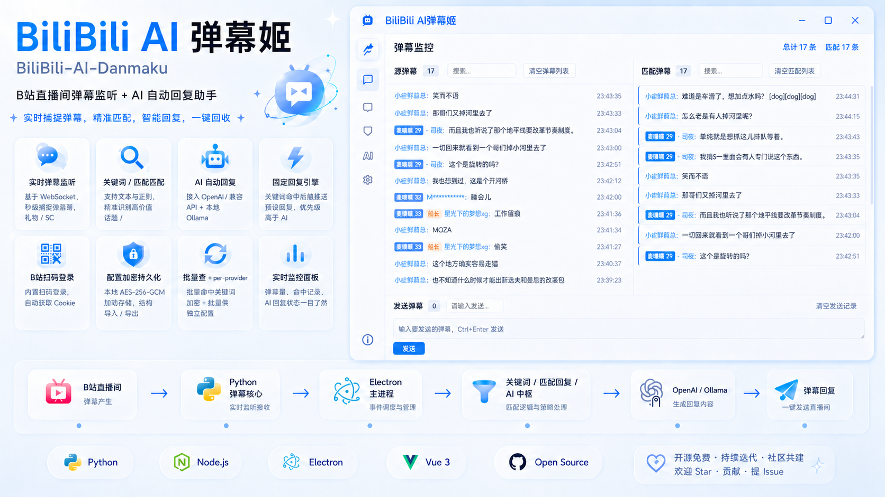

<h1 align="center">📺 BiliBili AI 弹幕姬</h1>

<p align="center">
  <strong>🎙️ B站直播间弹幕监听 + 🤖 AI 自动回复</strong><br>
  实时捕获弹幕 ⚡ 关键词精准匹配 🎯 大模型智能回复 💬 以弹幕形式回发直播间
</p>

<p align="center">
  
  
  
  
  
</p>

<p align="center">
  
</p>

> ⚠️ **声明**：这是一个 **Vibe Coding** 产物。大部分代码由 AI 生成，代码可能不够优雅，但——它和我有一个能跑就行。

---

## ✨ 功能特性

### 核心功能
- 🔴 **实时弹幕监听** — 基于 B站 WebSocket 协议，毫秒级接收弹幕、🎁礼物、💎SC
- 🎯 **关键词/正则匹配** — 支持纯文本、正则两种匹配模式，可配置大小写敏感和匹配范围（固定回复 / AI / 两者皆可）
- 🤖 **大模型回复** — 对接 OpenAI 兼容 API + 本地 Ollama，支持自定义 Prompt、发送间隔、队列上限、跳过规则
- ⚡ **固定回复引擎** — 关键词命中后直接发送预设回复，优先级高于 AI，低延迟无等待
- 🔑 **B站一键登录** — 内置 B站扫码登录弹窗，自动提取 Cookie，无需手动复制

### 直播间仪表板
- 📊 **实时仪表板** — 主播资料卡片、弹幕流、关键词命中统计、AI 队列状态一目了然
- 📈 **关键词命中排行** — 展示命中次数、匹配模式、优先级排名
- ⏱️ **AI 回复队列** — 实时显示待发送/已发送/跳过的 AI 回复状态
- 🎯 **捕捉开关** — 全局关键词捕捉开关独立控制，不影响 AI 与固定回复链路
- 🚫 **连接中断** — 连接过程中可随时点击「取消连接」中断握手

### 配置与管理
- 🔒 **配置加密持久化** — 凭证本地 AES-256-GCM 加密存储，支持导出/导入（可选择是否包含敏感信息）
- 🔄 **热重载** — 连接中修改配置自动生效，无需断开重连
- 📋 **模型列表** — OpenCode/Ollama 模型列表自动获取，实时更新
- 🔧 **per-provider 配置** — 每个模型供应商拥有独立的模型配置，自由切换
- 🔄 **版本检查** — 启动时自动检测 GitHub 最新 Release，提醒更新

### 监控与界面
- 📺 **弹幕监控面板** — 实时弹幕流、匹配命中列表、AI 队列状态一目了然
- 🎨 **主题切换** — 支持亮色/暗色/跟随系统三种主题模式
- ℹ️ **关于页面** — 版本信息、技术栈、开源致谢

## 🏗️ 架构概览

```
📺 B站直播间 ──WebSocket──> 🐍 Python 弹幕核心 ──stdio──> ⚡ Electron 主进程
                                            │
                              ┌────────────┼────────────┐
                              ▼            ▼            ▼
                          🎯 关键词    ⚡固定回复    🤖 AI 中继
                              │            │            │
                              │            └─────┬──────┘
                              │                  ▼
                              │          ┌───────┴───────┐
                              │          ▼               ▼
                              │    🌐 OpenAI API    🐳 Ollama (本地)
                              │
                              └──────────────> 📤 弹幕回复
                                                   ▲
                                                   │
                                          🎨 Vue 3 GUI ──┘
```

**核心数据流：**

1. 🐍 Python 核心通过 WebSocket 连接 B站弹幕服务器，实时接收弹幕
2. 📡 弹幕数据通过 **stdio JSON-RPC** 传递给 Electron 主进程
3. 🎯 关键词过滤器对每条弹幕做匹配，按 `scope` 路由到固定回复或 AI
4. ⚡ 固定回复优先级高于 AI，命中后直接发送，阻止 AI 重复回复
5. 🤖 AI 回复经发送间隔控制后回传 Python，以弹幕形式发回直播间
6. 🖥️ GUI 提供可视化配置和实时状态监控

**主进程模块架构：**

| 模块 | 职责 |
|------|------|
| `index.ts` | 组合根，初始化并串联所有子模块、IPC 注册 |
| `app-shell.ts` | 窗口创建/关闭、系统托盘、应用生命周期 |
| `app-context.ts` | 全局运行时上下文（窗口、服务、状态引用） |
| `app-utility-ipc.ts` | 应用工具 IPC（版本更新检查、外链打开） |
| `auth-window.ts` | B站扫码登录弹窗，自动提取 Cookie |
| `config-store.ts` | 配置加密读写与持久化 |
| `config-ipc.ts` | 配置相关的 IPC 通信桥接 |
| `danmaku-service.ts` | Python 进程管理、JSON-RPC 协议、弹幕收发、连接中断与预热 |
| `danmaku-routing.ts` | 弹幕路由判定纯函数（scope 解析、固定回复/AI 路由） |
| `dashboard-metrics-store.ts` | 直播间仪表板聚合器（关键词命中、AI 队列、主播资料快照） |
| `ai-relay.ts` | AI 模型对接（OpenAI 兼容 API / Ollama） |
| `ai-ipc.ts` | AI 相关的 IPC 通信桥接 |
| `quick-reply-engine.ts` | 固定回复引擎，关键词命中后直接发送预设回复 |
| `runtime-cache.ts` | 运行时临时状态（模型列表缓存等） |
| `logger.ts` | 统一日志工具 |

## 📁 项目结构

```
packages/
├── shared/                             # 📦 共享类型定义 (TypeScript)
│   ├── src/
│   │   ├── index.ts                    # 📤 统一导出
│   │   └── types.ts                    # 📋 类型定义（弹幕/关键词/JSON-RPC/配置）
│   ├── package.json
│   ├── tsconfig.json
│   └── tsconfig.build.json
│
├── danmaku-core/                       # 🐍 Python 弹幕核心
│   ├── receiver.py                     # 📥 弹幕接收器 (WebSocket)
│   ├── receiver.spec                   # 📦 PyInstaller 配置（接收器）
│   ├── sender.py                       # 📤 弹幕发送器 (HTTP API)
│   ├── sender.spec                     # 📦 PyInstaller 配置（发送器）
│   ├── danmaku.py                      # 🚪 入口 (JSON-RPC over stdio)
│   ├── bilibili_core_api.py            # 📡 主播资料查询（B站 API）
│   └── requirements.txt                # 📦 依赖
│
└── electron-app/                       # ⚡ Electron 桌面客户端
    ├── electron.vite.config.ts         # ⚙️ Vite 配置
    ├── build/
    │   ├── afterPack.js                # 🔨 electron-builder 打包后钩子（图标注入）
    │   └── installer.nsh               # 📦 NSIS 自定义安装/卸载脚本
    ├── main/                           # ⚡ 主进程（模块化架构）
    │   ├── index.ts                    # 🏠 组合根 + IPC 注册
    │   ├── app-shell.ts                # 🪟 窗口/托盘/生命周期
    │   ├── app-context.ts              # 🌐 全局运行时上下文
    │   ├── app-utility-ipc.ts          # 🔧 版本检查/外链打开
    │   ├── auth-window.ts              # 🔑 B站扫码登录
    │   ├── config-store.ts             # 🔐 配置加密存储
    │   ├── config-ipc.ts               # 📡 配置 IPC 桥接
    │   ├── danmaku-service.ts          # 🔌 Python 进程管理 + 弹幕收发 + 连接中断
    │   ├── danmaku-routing.ts          # 🎯 弹幕路由判定纯函数
    │   ├── dashboard-metrics-store.ts  # 📊 仪表板聚合器
    │   ├── ai-relay.ts                 # 🤖 AI 模型对接
    │   ├── ai-ipc.ts                   # 📡 AI IPC 桥接
    │   ├── quick-reply-engine.ts       # ⚡ 固定回复引擎
    │   ├── runtime-cache.ts            # 💾 运行时缓存
    │   └── logger.ts                   # 📝 日志
    ├── preload/
    │   └── index.ts                    # 🌉 桥接
    ├── renderer/
    │   ├── index.html
    │   └── src/
    │       ├── App.vue                  # 🎨 主界面（侧栏导航）
    │       ├── main.ts                  # 🚀 启动
    │       ├── env.d.ts                 # 📝 类型声明
    │       ├── styles/                  # 🎨 样式
    │       │   ├── app.css
    │       │   ├── global.css
    │       │   ├── about.css
    │       │   ├── danmaku.css
    │       │   ├── dev.css
    │       │   ├── keywords.css
    │       │   ├── live-room-dashboard.css
    │       │   ├── matched.css
    │       │   ├── model-settings.css
    │       │   └── room.css
    │       └── pages/
    │           ├── BoundaryView.vue     # 📊 直播间仪表板（弹幕流/关键词/AI队列）
    │           ├── dashboard/           # 📊 仪表板 composable
    │           │   └── useLiveRoomDashboard.ts
    │           ├── DanmakuView.vue      # 💬 弹幕实时监控
    │           ├── RoomView.vue         # 📺 直播间配置 + B站登录
    │           ├── KeywordsView.vue     # 🎯 关键词规则管理
    │           ├── MatchedView.vue      # ✅ 匹配命中记录
    │           ├── ModelSettingsView.vue # 🤖 AI 模型配置
    │           ├── AboutView.vue        # ℹ️ 关于（版本/主题/关闭行为/更新检查）
    │           └── DevView.vue          # 🔧 开发调试
    └── resources/
        └── icon.ico                     # 🖼️ 应用图标（多尺寸）
```

## 🚀 快速开始

### 📋 前置要求

| 依赖 | 最低版本 |
|------|---------|
| [Node.js](https://nodejs.org/) | ≥ 24 |
| [Python](https://www.python.org/) | = 3.13 |
| [pnpm](https://pnpm.io/) | ≥ 10 |

### 📥 安装

```bash
# 克隆仓库
git clone https://github.com/xgxdmx/BiliBili-AI-Danmaku.git
cd BiliBili-AI-Danmaku

# 📦 安装 Node 依赖
pnpm install

# 🐍 安装 Python 依赖
cd packages/danmaku-core && pip install -r requirements.txt
```

### 🛠️ 开发

```bash
# 🚀 启动 Electron 开发模式 (hot-reload)
pnpm dev

# ✅ 仅类型检查
pnpm typecheck

# 🔨 构建
pnpm build
```

### 📦 打包发布

```bash
# 🎁 完整打包 (Python EXE + Electron 安装包)
pnpm package

# 🐍 只打包 Python 部分
pnpm package:python

# ⚡ 只打包 Electron 部分
pnpm package:electron

# 🧹 清理构建产物
pnpm package:clean
```

> 打包脚本基于 Node.js (`scripts/build.mjs`)。

## ⚙️ 配置说明

应用首次启动后会自动创建加密配置文件，所有配置均可在 GUI 中完成，无需手动编辑文件。

### 🖱️ 方式一：GUI 配置（推荐）

1. 启动后点击左侧「📺 直播间」进入仪表板查看实时状态
2. 点击「🛠️ 直播间配置」进入配置页
3. 点击「🔑 B站登录」按钮扫码登录，自动获取 Cookie
4. 填写直播间房间号，点击「▶️ 开始监听」
5. 在「🎯 关键词」页面添加匹配规则
6. 在「🤖 大模型」页面配置 API 和 Prompt
7. 在「🔧 设置工具」页面管理全局开关与配置导入导出

### 📂 方式二：配置导入

支持在 GUI 中导入/导出 JSON 配置文件，方便在多台机器间同步。导出时可选择是否包含敏感信息。

配置结构示例：

```jsonc
{
  "room": {
    "roomId": 12345,
    "enabled": true,
    "minMedalLevel": 0,
    "captureEnabled": true,
    "sendOnDisconnect": true,
    "disconnectMessage": "先下播啦，感谢大家陪伴，我们下次见～"
  },
  "credentials": {
    "sessdata": "***",
    "biliJct": "***",
    "buvid3": "***"
  },
  "keywords": [
    { "pattern": "你好", "type": "keyword", "caseSensitive": false, "scope": "both", "enabled": true },
    { "pattern": "^签到$", "type": "regex", "scope": "quickReply", "enabled": true }
  ],
  "quickReplies": [
    { "contains": ["签到"], "reply": "感谢签到～", "cooldownMs": 5000, "enabled": true }
  ],
  "aiModel": {
    "provider": "opencode",
    "prompt": "你是一个直播间助理，逐条回复，单条不超过40字。",
    "sendIntervalMs": 1800,
    "maxPending": 100,
    "ignoreUsernames": [],
    "skipReplies": ["NO_REPLY", "无需回复", "忽略"],
    "providers": {
      "opencode": {
        "modelId": "minimax-m2.5-free",
        "apiKey": "sk-***",
        "endpoint": "https://opencode.ai/zen/v1/chat/completions",
        "temperature": 0.7,
        "topP": 0.9,
        "maxTokens": 500
      },
      "ollama": {
        "modelId": "qwen2.5:7b",
        "ollamaBaseUrl": "http://localhost:11434",
        "temperature": 0.7,
        "topP": 0.9,
        "maxTokens": 500,
        "ollamaKeepAlive": "5m",
        "requestTimeoutMs": 120000
      }
    }
  },
  "theme": "system"
}
```

### 🎯 关键词规则

| 字段 | 说明 |
|-----|------|
| `type: "keyword"` | 🔤 子串匹配，支持大小写控制 |
| `type: "regex"` | 📜 JavaScript 正则表达式，支持捕获组 |
| `scope: "both"` | 🎯 同时触发固定回复和 AI |
| `scope: "quickReply"` | ⚡ 仅触发固定回复，AI 处理所有弹幕 |
| `scope: "ai"` | 🤖 仅触发 AI，固定回复处理所有弹幕 |

### ⚡ 固定回复规则

| 字段 | 说明 |
|-----|------|
| `contains` | 🔎 包含任意关键词即命中 |
| `notContains` | 🚫 排除包含这些词的弹幕 |
| `regex` | 📜 正则匹配（与 contains 二选一） |
| `reply` | 💬 命中后发送的回复文本 |
| `cooldownMs` | ⏱️ 冷却时间 (ms)，防止刷屏 |

> ⚡ 固定回复优先级始终高于 AI。当弹幕命中固定回复规则时，AI 不会对该弹幕回复。

## 🧰 技术栈

| 层 | 技术 |
|---|------|
| 🐍 弹幕核心 | Python 3.13 + [blivedm](https://github.com/xfgryujk/blivedm) + aiohttp |
| 🔗 进程通信 | JSON-RPC 2.0 over stdio |
| 🤖 AI 对接 | TypeScript (OpenAI 兼容 API) |
| ⚡ 桌面客户端 | Electron 41 + Vue 3 + Vite 6 |
| 🔄 状态管理 | Vue 3 Composition API (provide/inject) |
| 🔒 配置持久化 | electron-store (AES-256-GCM 加密) |
| 📦 类型共享 | TypeScript project references |
| 🔨 构建 | electron-vite + electron-builder + PyInstaller |
| 📦 安装包 | NSIS (自定义安装/卸载/图标/中文界面) |
| 🔄 CI/CD | GitHub Actions (Windows + macOS 自动构建) |

## 📅 更新日志

| 版本 | 日期 | 主要改动                                                                                                                                                                                                   |
|:------:|:--------:|--------------------------------------------------------------------------------------------------------------------------------------------------------------------------------------------------------|
| **v0.5.0** | 2025-05 | 直播间仪表板页面（主播资料卡片、弹幕流、关键词命中排行、AI 队列状态）<br/>• 主播资料查询模块 `bilibili_core_api.py` <br/>• 仪表板聚合器 `dashboard-metrics-store.ts` 下沉主进程 <br/>• 弹幕路由纯函数 `danmaku-routing.ts` 抽离 <br/>• 连接中断功能（连接过程中可随时取消）<br/>• 延后预热策略（进入直播间配置页触发，避免首启卡顿）<br/>• 关键词捕捉开关仅控制关键词链路，不联动固定回复与 AI <br/>• 关键词空态提示修复（`hasEnabledKeywordRules` 全链路贯穿）<br/>• 打包修复（`bilibili_api` 动态子模块收集、UTF-8 编码强制、子进程生命周期优化）<br/>• 版本自动检查（GitHub Release 对比）<br/>• 模型列表更新策略修复 <br/>• 主进程新增 `app-utility-ipc.ts` 工具模块 |
| **v0.4.0** | 2025-04 | Python 入口 `run.py` → `danmaku.py` 全链路重命名（含 PyInstaller / 构建 / 部署脚本 / 安装器）<br/>• 关于页面新增关闭按钮行为设置（询问/最小化到托盘/直接退出）<br/>• 主进程可读性重构（弹幕路由纯函数、配置 IPC 助手拆分）<br/>• AI 握手兼容增强（多个 fallback 提取路径 + 响应预览诊断）<br/>• 样式外提收尾（所有页面内联样式迁移至独立 CSS） |
| **v0.3.0** | 2025-04 | 主进程模块化重构（12 个专职模块）<br/>• 固定回复优先级修复（高于 AI、全局开关同步）<br/>• 停止监听按钮交互增强 <br/>• 单实例限制防止重复启动 <br/>• NSIS 安装包完善（可选安装路径、安装后启动、完整卸载含配置保留选项）<br/>• 自定义应用图标（多尺寸 ICO + rcedit 注入）<br/>• 关于页面（版本/主题/技术栈） |
| **v0.2.0** | 2025-04 | OpenCode 模型列表自动获取、启动时实时拉取可用模型 <br/>• 新增亮色/暗色/跟随系统三种主题模式 <br/>• 导出配置可选择是否包含敏感信息 <br/>• 每个模型供应商独立配置、连接中自动热重载 <br/>• 菜单栏间距优化 |
| **v0.1.2** | 2025-04 | Ollama 模型参数自定义（温度/Top P/Max Token/Keep-Alive/超时）<br/>• 自动识别 Ollama 模型列表 <br/>• 修复 Thinking 过程误识别问题 <br/>• 优化弹幕回复提取逻辑、减少 NO_REPLY |
| **v0.1.1** | 2025-02 | 修复打包异常  |
| **v0.1.0** | 2025-01 | 初始版本：B站弹幕监听+关键词匹配 <br/>• AI 自动回复（OpenCode/Ollama 双供应商）<br/>• B站扫码登录 <br/>• 配置加密存储  |

## ⚠️ 安全提醒

> 🔴 **配置文件包含 B站 Cookie 和 AI API Key 等敏感信息！**
>
> - 🔒 `config.json` 已在 `.gitignore` 中排除，**绝不可提交到版本控制**
> - 🏷️ 配置文件使用基于机器指纹的 AES-256-GCM 加密存储
> - 📄 导出的配置文件为明文，仅用于本地迁移，**务必妥善保管**
> - 🚫 如需分享项目，请确保清除所有包含凭证的文件

## 📄 许可证

本项目基于 Apache License 2.0 开源许可。

- ✅ 可免费使用于商业和非商业目的
- ✅ 可自由修改和分发
- ✅ 需保留原始许可证声明
- ❌ 不得使用项目名称进行背书

详细条款请参阅 [LICENSE](./LICENSE) 文件。
